# UAH/USD rates project

*This project completes homework #4: Monitoring systems for user metrics.*

A simple `Python` web-server fetches NBU (National Bank of Ukraine) 
official UAH/USD rates from [public API](https://bank.gov.ua/ua/open-data/api-dev).
Also, it uses Privat24 [public API](https://api.privatbank.ua/#p24/exchange) to obtain real 
rates from Cash and No-Cash markets. 
After gathering the info it pushes the event with rates
to pre-configured [Google Analytics v4 property](https://developers.google.com/analytics/devguides/collection/ga4).

## Prerequisites

* Installed [Docker](https://www.docker.com/products/docker-desktop/)
* Configured Google Analytics v4 [property](https://developers.google.com/analytics/devguides/collection/ga4) and [Web Stream](https://support.google.com/analytics/answer/9304153#stream&zippy=%2Cweb).
* Fill the following variables `<YOUR_GA_API_SECRET>`, `<YOUR_GA_MEASUREMENT_ID>` 
with actual values in the `main.py` file.

## Build and run

To build Docker image execute following command:

```bash
$ docker build -t rates-app .
```

Then, to run the image inside Docker container enter following command:

```bash
docker run -idt -p 8080:8080 --name rates-app-container rates-app:latest
```

### Accessing the pages

After that, you can access the server with your browser using http://localhost:8080 URL.

Once the page is loaded, you will see the input 
with your Google client id *(obtained by GA4 tag)* and button with `Go!` sign.

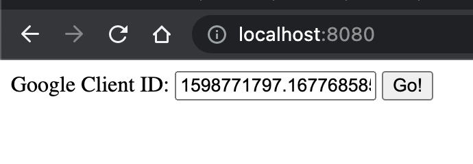

After clicking the button your Google client id will be used to send 
the `uah_rates` event with UAH/USD rates to GA4 using Measurement Protocol.
And you will see the rates too, they will appear on the screen.

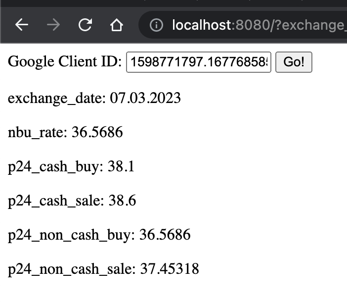

### Debugging

To run the script in `debug` mode you just need to replace the line 6:

```python
DEBUG = True
```

After that, you need to [build](#build-and-run) new image and recreate the container. 
Debug mode is activated.

## Results

*screenshots from Google Analytics dashboards*

### Realtime User Monitoring View

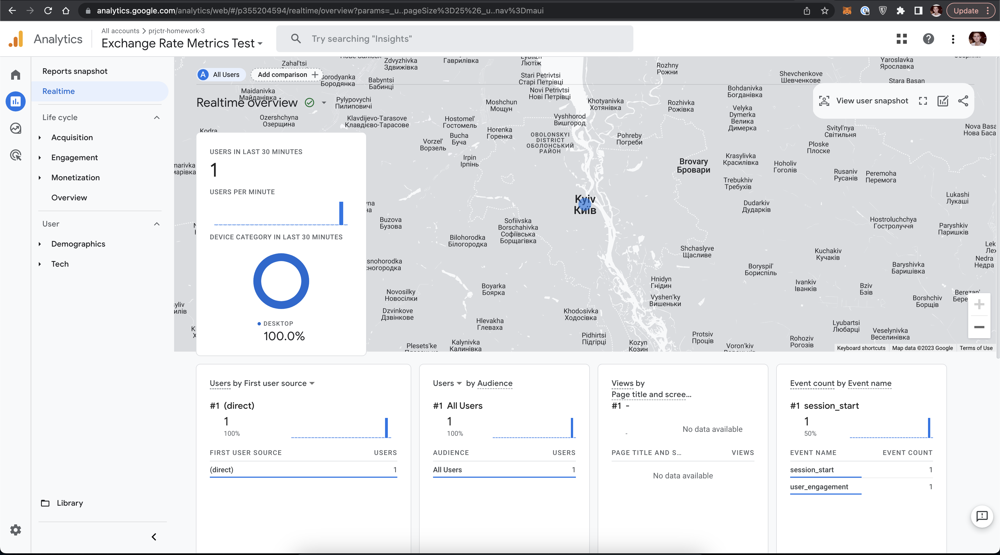

We could see that our page is very lonely 😔

But we could see the location of ourselves 😃

### Acquisition

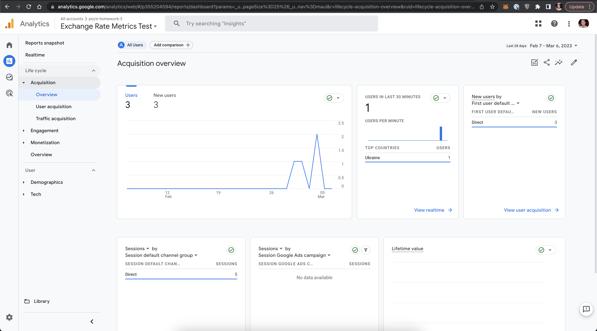

Google identified my browser with the same Google client id 
as three different users for all the time.

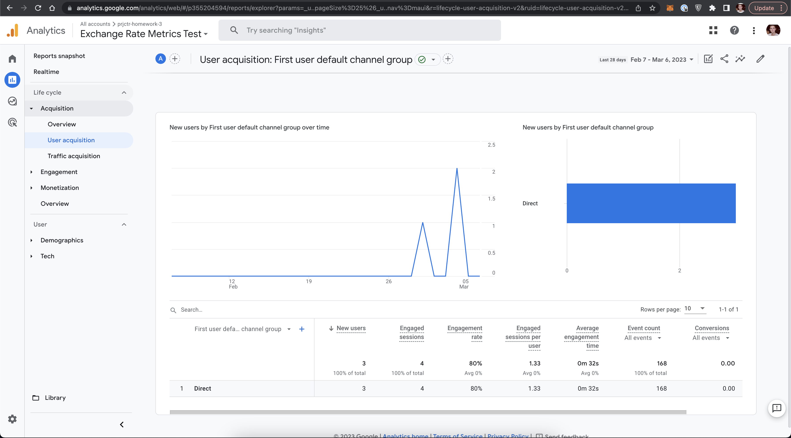

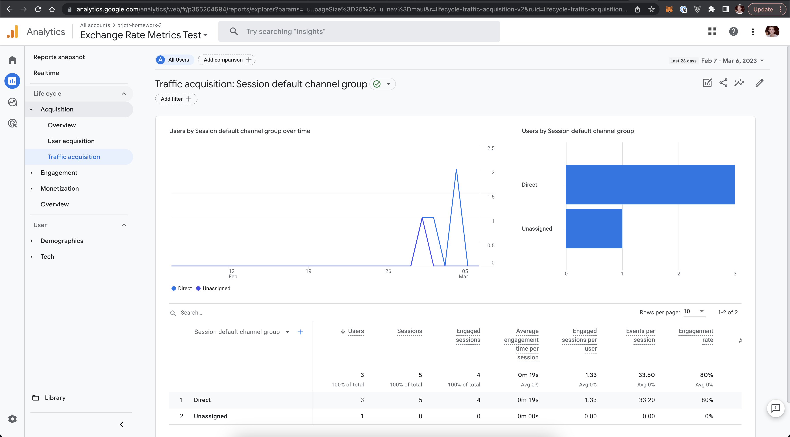

### Engagement

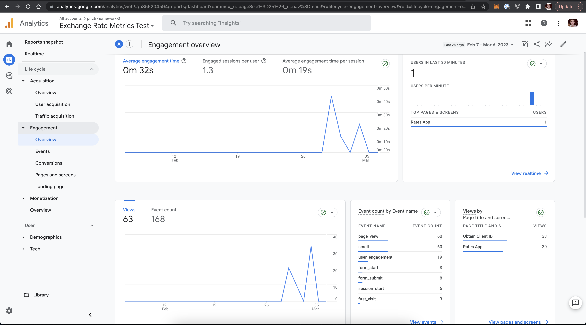

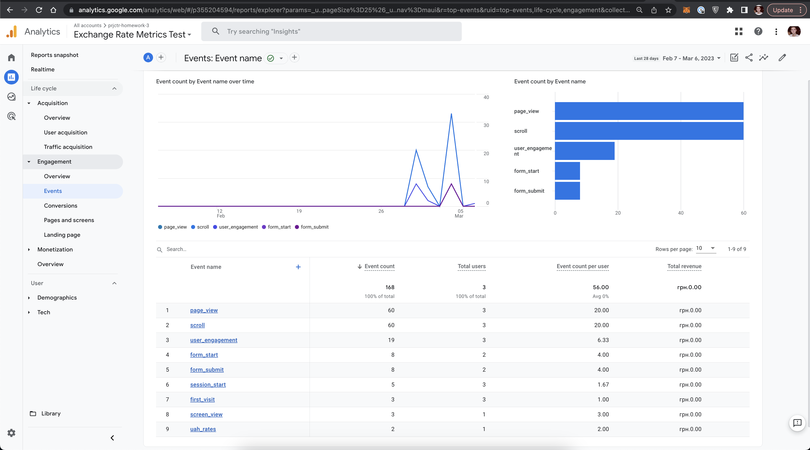

With the correct configured GA4 property and Web Stream, 
I still can't manage to receive rates event in the GA Dashboard.

We can see all other events that were sent from `gtag.js` script directly. 
But the custom event was received only a few times 
(these were from Google [event builder](https://ga-dev-tools.google/ga4/event-builder/)). 
So GA4 doesn't want to process this custom event while sending from the web-server.

### Other stuff

Retention:

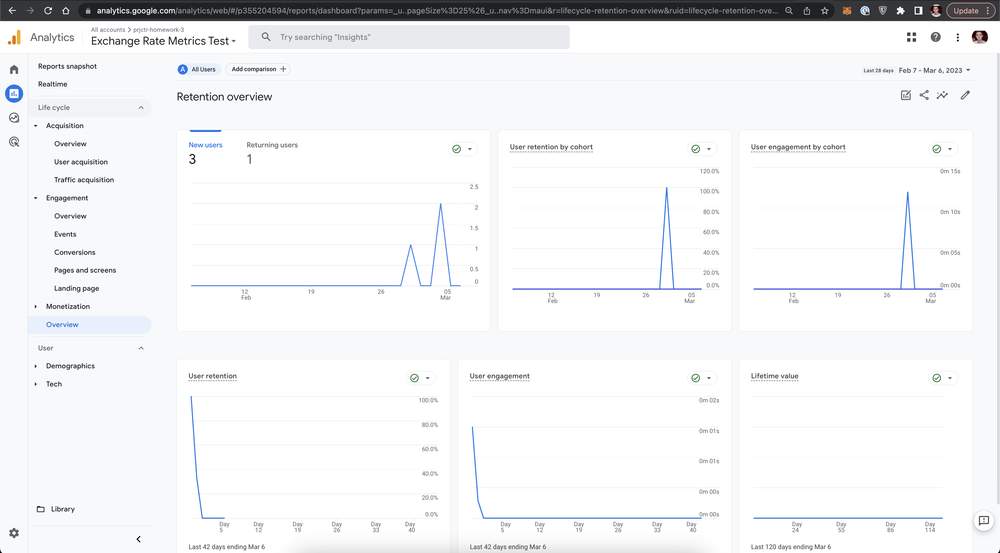

Demographics:

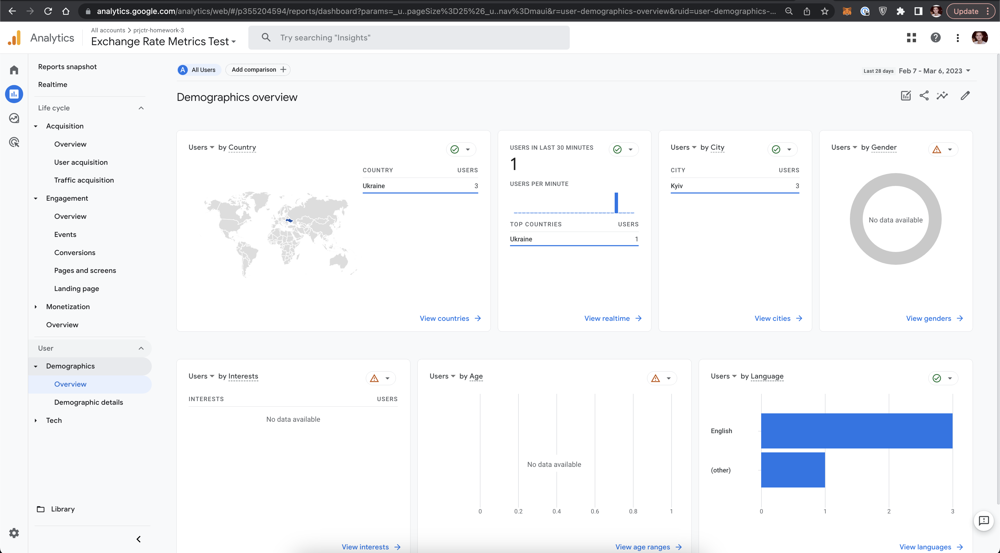

Tech part:

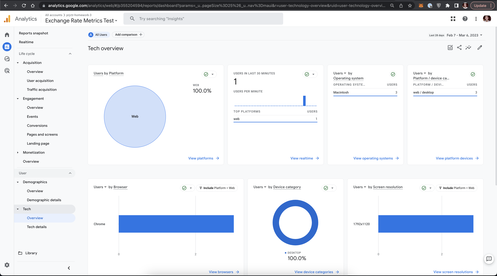